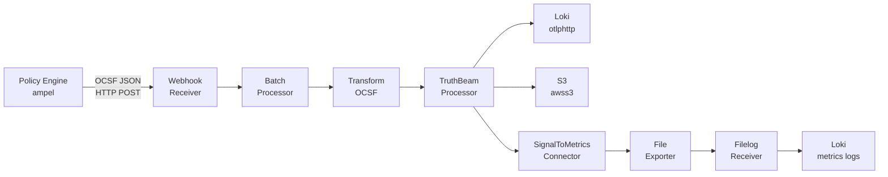
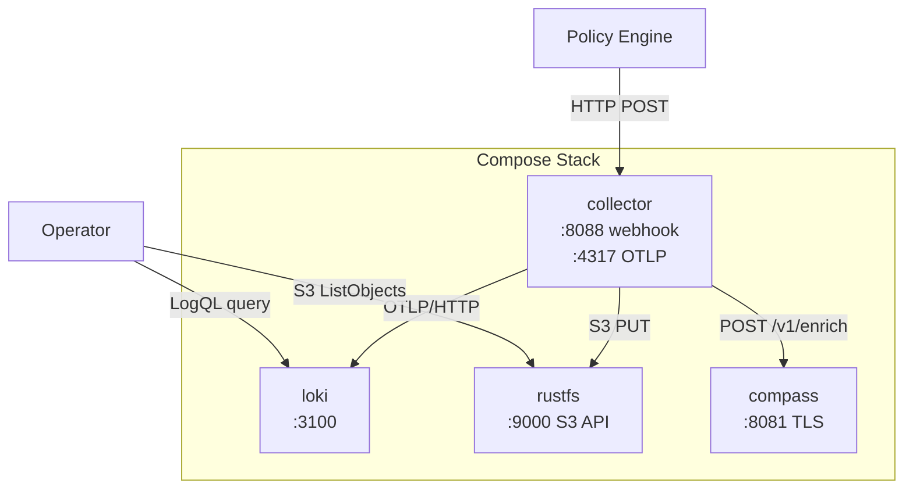
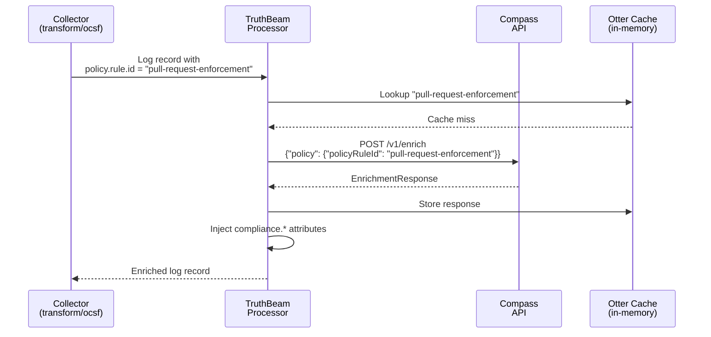

# Compliance Evidence Path

How a single compliance evidence record flows through the ComplyBeacon pipeline,
from initial emission to queryable storage and operational metrics.

This walkthrough tracks one record end-to-end: a `pull-request-enforcement` control
evaluation from the [AMPEL Branch Protection](https://quay.io/complytime/policies-ampel-branch-protection)
policy bundle. Every JSON snippet, query result, and attribute value shown here was
captured from the live integration test environment (`task test:integration PROFILE=compliance`).

For architecture context, see [DESIGN.md](./DESIGN.md). For local development
setup, see [DEVELOPMENT.md](./DEVELOPMENT.md).

---

## Table of Contents

1. [Pipeline Overview](#1-pipeline-overview)
2. [Stage 1 -- Evidence Emission](#2-stage-1----evidence-emission)
3. [Stage 2 -- Ingestion and OCSF Transform](#3-stage-2----ingestion-and-ocsf-transform)
4. [Stage 3 -- Enrichment via TruthBeam and Compass](#4-stage-3----enrichment-via-truthbeam-and-compass)
5. [Stage 4 -- Log Export to Loki](#5-stage-4----log-export-to-loki)
6. [Stage 5 -- Partitioned Storage in S3](#6-stage-5----partitioned-storage-in-s3)
7. [Stage 6 -- Metrics Pipeline](#7-stage-6----metrics-pipeline)
8. [Validation Matrix](#8-validation-matrix)
9. [Architecture Reference](#9-architecture-reference)
10. [Reproducing This Walkthrough](#10-reproducing-this-walkthrough)

---

## 1. Pipeline Overview

Evidence enters the Beacon Collector as an OCSF ScanActivity record, moves
through attribute extraction and compliance enrichment, then fans out to three
destinations: a log aggregator (Loki), partitioned object storage (S3), and
an internal metrics pipeline.

### Data Flow



### Container Topology



---

## 2. Stage 1 -- Evidence Emission

A policy engine evaluates a control and produces an OCSF ScanActivity record.
The tracked record represents a `pull-request-enforcement` check from the
AMPEL Branch Protection catalog (`repo-branch-protection`).

### OCSF ScanActivity (input)

```json
{
  "activity_id": 0,
  "category_name": "Application Activity",
  "category_uid": 6,
  "class_name": "Scan Activity",
  "class_uid": 6007,
  "metadata": {
    "log_provider": "ampel",
    "product": {
      "name": "ampel",
      "vendor_name": "ampel",
      "version": "v0.1.0"
    },
    "uid": "ampel-repo-branch-protection-pull-request-enforcement",
    "version": "v0.1.0"
  },
  "status": "success",
  "status_id": 1,
  "severity": "unknown",
  "severity_id": 0,
  "policy": {
    "data": "{\"name\":\"AMPEL Policy\",\"description\":\"Policy from ampel-branch-protection bundle\",\"sources\":[{\"name\":\"require-pull-request\",\"config\":{\"include\":[\"pull-request-enforcement\"]}}]}",
    "desc": "Assessment for pull-request-enforcement",
    "name": "AMPEL Policy",
    "uid": "pull-request-enforcement"
  },
  "action": "observed",
  "action_id": 3,
  "scan": { "type_id": 0 },
  "type_uid": 60070
}
```

Key fields the downstream pipeline depends on:

| OCSF Field | Value | Used By |
|---|---|---|
| `policy.uid` | `pull-request-enforcement` | transform/ocsf sets `policy.rule.id` |
| `policy.data` (JSON) | `sources[0].name` = `require-pull-request` | transform/ocsf sets `policy.control.id` |
| `policy.data` (JSON) | `sources[0].config.include[0]` = `pull-request-enforcement` | transform/ocsf sets `policy.config.include` |
| `metadata.product.name` | `ampel` | transform/ocsf sets `policy.engine.name` |
| `status` | `success` | transform/ocsf maps to `policy.evaluation.result` = `Passed` |

### HTTP Submission

The record is POSTed to the collector's webhook receiver:

```
POST /eventsource/receiver HTTP/1.1
Host: localhost:8088
Content-Type: application/json

< evidence.json
```

Response: `200 OK`. The receiver is configured in `configs/collector-enrichment.yaml`
under `receivers.webhookevent`.

---

## 3. Stage 2 -- Ingestion and OCSF Transform

The `webhookevent` receiver accepts the POST body as a log record and forwards
it into the `logs/analysis_pipeline`:

```yaml
# configs/collector-enrichment.yaml (excerpt)
pipelines:
  logs/analysis_pipeline:
    receivers: [webhookevent, otlp]
    processors: [batch, transform/ocsf, truthbeam]
    exporters: [debug, otlphttp/logs, awss3/logs, signaltometrics]
```

### Attribute Extraction

The `transform/ocsf` processor double-parses the OCSF JSON to extract
structured attributes from the nested `policy.data` field:

| Extracted Attribute | Source Expression | Value |
|---|---|---|
| `policy.rule.id` | `ParseJSON(body)["policy"]["uid"]` | `pull-request-enforcement` |
| `policy.control.id` | `ParseJSON(ParseJSON(body)["policy"]["data"])["sources"][0]["name"]` | `require-pull-request` |
| `policy.config.include` | `...["sources"][0]["config"]["include"][0]` | `pull-request-enforcement` |
| `policy.engine.name` | `ParseJSON(body)["metadata"]["product"]["name"]` | `ampel` |
| `policy.evaluation.result` | status mapping (`success` -> `Passed`) | `Passed` |
| `severity` | `ParseJSON(body)["severity"]` | `unknown` |

The processor also promotes `policy.rule.id` to a resource-level attribute:

```yaml
- set(resource.attributes["policy.rule.id"], attributes["policy.rule.id"])
    where attributes["policy.rule.id"] != nil
```

This resource attribute controls S3 object partitioning in Stage 5.

---

## 4. Stage 3 -- Enrichment via TruthBeam and Compass

After attribute extraction, the log record passes to the `truthbeam` processor.
TruthBeam reads `policy.rule.id` from the record's attributes and sends an
enrichment request to the Compass API.

### Enrichment Sequence



### Compass Request

```json
{
  "policy": {
    "policyEngineName": "ampel",
    "policyRuleId": "pull-request-enforcement"
  }
}
```

### Compass Response

```json
{
  "compliance": {
    "control": {
      "id": "pull-request-enforcement",
      "catalogId": "repo-branch-protection",
      "category": "Source Code"
    },
    "enrichmentStatus": "Success",
    "frameworks": {
      "frameworks": ["AMPEL Branch Protection"],
      "requirements": ["require-pull-request"]
    }
  }
}
```

### Injected Attributes

TruthBeam maps the Compass response fields to OTel log attributes:

| Attribute | Value | Source |
|---|---|---|
| `compliance.control.id` | `pull-request-enforcement` | `compliance.control.id` |
| `compliance.control.catalog.id` | `repo-branch-protection` | `compliance.control.catalogId` |
| `compliance.control.category` | `Source Code` | `compliance.control.category` |
| `compliance.enrichment.status` | `Success` | `compliance.enrichmentStatus` |
| `compliance.status` | `Compliant` | Derived (enrichment succeeded) |
| `compliance.frameworks` | `["AMPEL Branch Protection"]` | `compliance.frameworks.frameworks` |
| `compliance.requirements` | `["require-pull-request"]` | `compliance.frameworks.requirements` |

After enrichment, the log record carries 13 structured attributes (6 from
transform/ocsf, 7 from TruthBeam) plus the original OCSF JSON as the body.

---

## 5. Stage 4 -- Log Export to Loki

The enriched log record is exported to Loki via the `otlphttp/logs` exporter
(`http://loki:3100/otlp`). Loki indexes a subset of resource attributes as
labels for efficient querying.

### Indexed Labels

The Loki configuration (`configs/loki.yaml`) indexes these resource attributes
as stream labels via `otlp_config.resource_attributes`:

- `compliance.control.id`
- `compliance.control.catalog.id`
- `compliance.control.category`
- `compliance.status`
- `policy.rule.id`
- `policy.engine.name`
- `policy.evaluation.result`

Remaining attributes are stored as structured metadata, queryable with
`| key="value"` filter syntax after the stream selector.

### Querying the Evidence

Basic query by control:

```
{policy_rule_id="pull-request-enforcement"}
```

Filter for successfully enriched records:

```
{policy_rule_id="pull-request-enforcement"} | compliance_enrichment_status="Success"
```

### Live Query Result (stream labels)

```
policy_rule_id:                pull-request-enforcement
policy_engine_name:            ampel
policy_evaluation_result:      Passed
policy_control_id:             require-pull-request
policy_config_include:         pull-request-enforcement
compliance_control_id:         pull-request-enforcement
compliance_control_catalog_id: repo-branch-protection
compliance_control_category:   Source Code
compliance_enrichment_status:  Success
compliance_status:             Compliant
compliance_frameworks:         ["AMPEL Branch Protection"]
compliance_requirements:       ["require-pull-request"]
```

The log body contains the original OCSF ScanActivity JSON, preserved
unmodified from Stage 1.

---

## 6. Stage 5 -- Partitioned Storage in S3

The `awss3/logs` exporter writes evidence to S3-compatible object storage
(RustFS in the test environment). Objects are partitioned by `policy.rule.id`
using the `resource_attrs_to_s3.s3_prefix` configuration:

```yaml
# configs/collector-enrichment.yaml (excerpt)
awss3/logs:
  s3uploader:
    s3_bucket: ${S3_BUCKETNAME}
    file_prefix: "evidence_"
    unique_key_func_name: uuidv7
    s3_partition_format: ""
  resource_attrs_to_s3:
    s3_prefix: "policy.rule.id"
```

When `resource_attrs_to_s3.s3_prefix` is set, it **replaces** (not appends to)
the static `s3_prefix`. The resulting object key is:

```
{policy.rule.id}/evidence_{uuidv7}.json
```

### Live S3 Object

```
Key:  pull-request-enforcement/evidence_logs_019e9084-98cf-77b6-8d88-f2451dcb4fdf.json
Size: 2561 bytes
```

The object contains an OTLP ExportLogsServiceRequest with the full enriched
log record:

```
Resource
  policy.rule.id = "pull-request-enforcement"    <-- partitioning key

Scope: otlp/webhookevent

LogRecord
  Body: <original OCSF JSON>
  Attributes:
    policy.rule.id             = "pull-request-enforcement"
    policy.control.id          = "require-pull-request"
    policy.config.include      = "pull-request-enforcement"
    policy.engine.name         = "ampel"
    policy.evaluation.result   = "Passed"
    severity                   = "unknown"
    compliance.status          = "Compliant"
    compliance.enrichment.status = "Success"
    compliance.control.id      = "pull-request-enforcement"
    compliance.control.catalog.id = "repo-branch-protection"
    compliance.control.category = "Source Code"
    compliance.requirements    = ["require-pull-request"]
    compliance.frameworks      = ["AMPEL Branch Protection"]
```

Listing all evidence for a control:

```bash
curl "http://localhost:9000/complybeacon-evidence?list-type=2&prefix=pull-request-enforcement/"
```

The test bucket uses anonymous public access (`rc anonymous set public`) so no
authentication headers are needed for read operations.

---

## 7. Stage 6 -- Metrics Pipeline

The `signaltometrics` connector converts enriched log records into counter
metrics. These metrics flow through a separate pipeline:

```
signaltometrics -> batch/metrics -> file/metrics -> filelog/metrics -> transform/metrics_to_logs -> otlphttp/logs (Loki)
```

### Generated Metrics

Each evidence record produces 8 counter metrics, all scoped under
`policy.rule.id` as a resource attribute:

| Metric Name | Description |
|---|---|
| `compliance.control.evaluations` | Total evaluations processed |
| `compliance.control.evaluation.result` | Count by result (Passed/Failed/etc.) |
| `compliance.control.status` | Count by compliance status |
| `compliance.control.config.include` | Count by policy config include value |
| `compliance.control.by.engine` | Count by policy engine |
| `compliance.control.by.category` | Count by control category |
| `compliance.control.by.enrichment.status` | Count by enrichment status |
| `compliance.control.by.severity` | Count by severity level |

Metrics are written as OTLP JSON to `/data/metrics.jsonl` by the file exporter,
then re-ingested by the `filelog/metrics` receiver and forwarded to Loki as log
records. This two-hop path (metrics -> file -> logs) allows metrics to be
queried alongside evidence logs in a single backend.

---

## 8. Validation Matrix

The integration test suite (`tests/integration/compliance/`) validates all five
AMPEL Branch Protection controls through the full pipeline. Each control is
tested for Loki queryability and S3 partitioning.

| Control ID | Requirement ID | Loki Query | S3 Prefix | Enrichment |
|---|---|---|---|---|
| `pull-request-enforcement` | `require-pull-request` | `{policy_rule_id="pull-request-enforcement"}` | `pull-request-enforcement/` | `compliance_enrichment_status="Success"` |
| `approval-requirements` | `minimum-approvals` | `{policy_rule_id="approval-requirements"}` | `approval-requirements/` | `compliance_enrichment_status="Success"` |
| `force-push-restriction` | `block-force-push` | `{policy_rule_id="force-push-restriction"}` | `force-push-restriction/` | `compliance_enrichment_status="Success"` |
| `admin-bypass-prevention` | `prevent-admin-bypass` | `{policy_rule_id="admin-bypass-prevention"}` | `admin-bypass-prevention/` | `compliance_enrichment_status="Success"` |
| `code-owner-enforcement` | `require-code-owner-review` | `{policy_rule_id="code-owner-enforcement"}` | `code-owner-enforcement/` | `compliance_enrichment_status="Success"` |

The enrichment check is tested only for `pull-request-enforcement` as the
representative control, since all five share the same Compass response
structure and TruthBeam code path.

---

## 9. Architecture Reference

### Component Roles

| Component | Role | Config |
|---|---|---|
| Webhook Receiver | Accepts OCSF ScanActivity over HTTP | `configs/collector-enrichment.yaml` |
| Transform/OCSF | Extracts policy attributes from OCSF JSON | `configs/collector-enrichment.yaml` |
| TruthBeam | Enriches records via Compass API | `truthbeam/` module |
| Compass | Returns compliance context for a policy rule | `tests/integration/mock-compass/` |
| OTLP/HTTP Exporter | Sends enriched logs to Loki | `configs/collector-enrichment.yaml` |
| AWS S3 Exporter | Writes partitioned evidence to object storage | `configs/collector-enrichment.yaml` |
| SignalToMetrics | Converts logs to counter metrics | `configs/collector-enrichment.yaml` |
| Loki | Log aggregation and querying | `configs/loki.yaml` |
| RustFS | S3-compatible object storage | `compose.yaml` |

### Attribute Reference

Attributes are defined in `model/attributes.yaml` and generated into Go
constants by `task codegen:weaver-codegen`. Two attribute groups apply:

**Policy Engine Attributes** (`registry.policy`):

| Attribute | Type | Requirement |
|---|---|---|
| `policy.engine.name` | string | required |
| `policy.rule.id` | string | opt_in |
| `policy.evaluation.result` | enum | required |
| `policy.engine.version` | string | recommended |
| `policy.rule.name` | string | opt_in |
| `policy.rule.uri` | string | recommended |
| `policy.evaluation.message` | string | opt_in |
| `policy.target.id` | string | recommended |
| `policy.target.name` | string | recommended |
| `policy.target.type` | string | recommended |
| `policy.target.environment` | string | recommended |

**Compliance Assessment Attributes** (`registry.compliance`):

| Attribute | Type | Requirement |
|---|---|---|
| `compliance.control.id` | string | required |
| `compliance.control.catalog.id` | string | required |
| `compliance.control.category` | string | recommended |
| `compliance.enrichment.status` | enum | required |
| `compliance.status` | enum | required |
| `compliance.frameworks` | string[] | recommended |
| `compliance.requirements` | string[] | recommended |
| `compliance.risk.level` | enum | opt_in |
| `compliance.remediation.action` | enum | opt_in |
| `compliance.remediation.status` | enum | opt_in |
| `compliance.assessment.id` | string | recommended |
| `compliance.control.applicability` | string[] | opt_in |
| `compliance.remediation.exception.id` | string | opt_in |
| `compliance.remediation.exception.active` | boolean | opt_in |
| `compliance.remediation.description` | string | opt_in |

---

## 10. Reproducing This Walkthrough

### Prerequisites

- Podman and podman-compose
- Go toolchain (see `go.work` for version)
- `complyctl` (`task tools:install-complyctl`)
- Policy bundle: `complyctl get` with `tests/integration/complytime.yaml`

### Steps

```bash
# 1. Pull the AMPEL Branch Protection policy bundle
complyctl get -c tests/integration/complytime.yaml

# 2. Start the full stack with compliance profile
task test:integration PROFILE=compliance KEEP_ALIVE=true

# 3. POST evidence for a control
curl -X POST http://localhost:8088/eventsource/receiver \
  -H "Content-Type: application/json" \
  -d @- <<'EOF'
{
  "class_uid": 6007,
  "class_name": "Scan Activity",
  "category_uid": 6,
  "category_name": "Application Activity",
  "metadata": {
    "log_provider": "ampel",
    "product": {"name": "ampel", "vendor_name": "ampel", "version": "v0.1.0"},
    "uid": "ampel-repo-branch-protection-pull-request-enforcement",
    "version": "v0.1.0"
  },
  "status": "success",
  "status_id": 1,
  "severity": "unknown",
  "severity_id": 0,
  "policy": {
    "data": "{\"name\":\"AMPEL Policy\",\"description\":\"Policy from ampel-branch-protection bundle\",\"sources\":[{\"name\":\"require-pull-request\",\"config\":{\"include\":[\"pull-request-enforcement\"]}}]}",
    "desc": "Assessment for pull-request-enforcement",
    "name": "AMPEL Policy",
    "uid": "pull-request-enforcement"
  },
  "action": "observed",
  "action_id": 3,
  "scan": {"type_id": 0},
  "type_uid": 60070
}
EOF

# 4. Query Loki for the enriched record (wait ~10s for processing)
curl -sG "http://localhost:3100/loki/api/v1/query_range" \
  --data-urlencode 'query={policy_rule_id="pull-request-enforcement"}' \
  --data-urlencode "start=$(date -d '1 hour ago' --iso-8601=seconds)" \
  --data-urlencode 'limit=5' | jq .

# 5. List S3 objects partitioned by control
curl "http://localhost:9000/complybeacon-evidence?list-type=2&prefix=pull-request-enforcement/"

# 6. Tear down
task infra:undeploy
```

Port numbers above assume default compose mappings. If running with offset
ports (integration test mode), add the appropriate offset (e.g., 18088, 13100,
19000).
